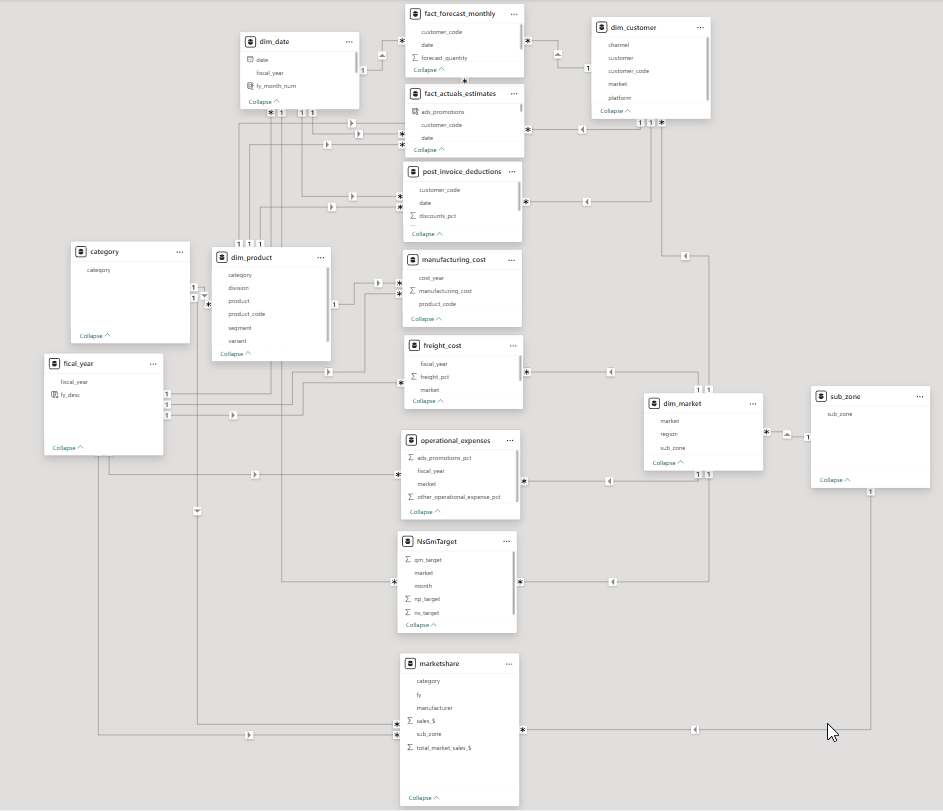

# Business Insights 360

## 📊 Project Overview  
**Business Insights 360** is a comprehensive data analytics solution developed for a simulated company, **AtliQ Hardware**, aiming to enable data-driven decision-making across departments like Finance, Sales, Marketing, and Supply Chain. The company, facing increasing competition and recent setbacks due to intuition-based decisions, has now embraced Power BI and SQL-based analytics to gain a competitive edge.  

This end-to-end BI solution was created as part of a capstone project, following best practices taught in the Codebasics Power BI course. The project simulates a real-world analytics implementation from data ingestion to dashboard deployment.

🔗 [Codebasics Power BI Course](https://www.codebasics.io)

🔗 **[Live Report](https://app.powerbi.com/view?r=eyJrIjoiYjBlNzQ5YjMtZjk3NC00MTEwLTk3NWYtMjlkZDA2MDY3ODNkIiwidCI6ImM2ZTU0OWIzLTVmNDUtNDAzMi1hYWU5LWQ0MjQ0ZGM1YjJjNCJ9)**

---

## ⚙️ Tech Stack

- **SQL** (Data extraction, transformation, joins)
- **Power BI Desktop**
- **Microsoft Excel**
- **DAX (Data Analysis Expressions)**
- **DAX Studio** (for performance optimization)
- **Power BI Service** (for publishing, collaboration, and auto-refresh)

---

## 🧠 Skills & Concepts Demonstrated

### 🗂️ Data Modeling & ETL
- Created **star and snowflake schema** models
- Optimized relationships using **surrogate keys** and **bridge tables**
- Built a **date table using M language**
- Applied **data validation** and **cleaning** practices in Power Query

### 📐 DAX & Visual Analytics
- Developed **calculated columns and measures**
- Used `DIVIDE()` to avoid zero-division errors
- Applied **KPI cards, dynamic titles**, and **conditional formatting**
- Implemented **bookmark navigation**, **page buttons**, and drill-throughs

### 🖥️ Power BI Service
- Published reports to the Power BI Service
- Configured **scheduled refresh via Personal Gateway**
- Created **Power BI Apps** for easy stakeholder access
- Managed **workspace permissions and collaboration**

---

## 🧾 Business Metrics & Terminology Covered
- **Gross Price**, **Net Invoice Sale**, **Net Profit**
- **COGS** (Cost of Goods Sold), **Gross Margin**
- **YTD** (Year-To-Date), **YTG** (Year-To-Go)
- Distribution channels: **Direct**, **Retailers**, **Distributors**
- Platforms: **E-commerce**, **Brick & Mortar**

---

## 🏢 Company Background
AtliQ Hardware is a global player in computer accessories, operating through multiple channels and platforms. After suffering losses due to reliance on manual reports and intuition, the company invested in analytics to monitor performance, reduce costs, and make data-backed strategic decisions.

---

## ❓ Questions Addressed Before Kickoff
- What are the project objectives and success criteria?
- Who are the primary stakeholders and users of this report?
- What insights do they expect to gain?
- What challenges or fears do they have about analytics?
- What data is required, and who owns it?

---

## 🧾 Dataset Overview

### 📚 Dimension Tables
- `dim_customer`: 75 customers, 27 markets, 2 platforms
- `dim_market`: Market zones and region hierarchy
- `dim_product`: 14 categories, multiple variants

### 📈 Fact Tables
- `fact_sales_monthly`: Monthly actual sales quantity
- `fact_forecast_monthly`: Forecasted quantities per customer
- `gross_price`, `manufacturing_cost`, `freight_cost`
- `pre_invoice_deductions`, `post_invoice_deductions`

📌 Data imported from **MySQL** using native connector in Power BI.

---

## 🧱 Data Model
- Implemented using **Snowflake Schema**
- Relationships maintained with surrogate keys
- Model optimized using **DAX Studio**
  

---

## 📊 Dashboard Design & Features

### Homepage
- Navigation pane with buttons to all report sections

### Report Pages
- **Info Page**

- **Finance Dashboard**

- **Sales Analytics**

- **Marketing Insights**

- **Supply Chain Operations**

- **Executive Summary**

---

## ✅ Project Outcomes
- Provided a unified platform for cross-functional insights
- Improved stakeholder understanding of revenue, cost, and margin drivers
- Enabled deeper questioning through interactive dashboards
- Set the foundation for automated reporting and self-service analytics

---

## 📁 GitHub Version Control
- Used **Git LFS** for managing large `.pbix` files
- Tracked and versioned dataset updates and visual enhancements

---

> 🔍 This project showcases my ability to translate business requirements into actionable insights using industry-standard tools like Power BI and SQL, and is a strong representation of my capabilities as a data analyst.
